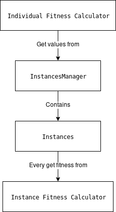

# Genetic Algorithm

## Legend
1. [About](#about)
2. [How to use](#how-to-use)
3. [Instance vs Individual](#instance-vs-individual)
4. [API](#)
5. [Structure](#)

## About
Genetic algorithm is meta-heuristic term.
It basically means modifying genotype (set of zeros and ones),
in order to get an optimal solution in a rational time.

The fact is that Genetic algorithm is not an algorithm, but an
abstract term generalizing set of methods. Be aware of this fact.

## How to use
In order to use this module you should be familiarized with
the following:

- GeneticAlgorithm.h - main class
- FitnessCalculator.h - interface for the function that calculates fitness

## Instance vs Individual
The most common issue with the module is the difference between
these terms.

 - Instance is the wrapper of the AnalyzedType class, which is the
class on which we are working. It contains method to calculate fitness
for the given AnalyzedType

 - Individual, however, is responsible for handling and operating on the
 genotype and  calculating fitness for it.

 So the Individual Fitness Calculator is basically the function that calculates
 fitness from the values calculated with the Instance Fitness Calculator.

 Graphically:

